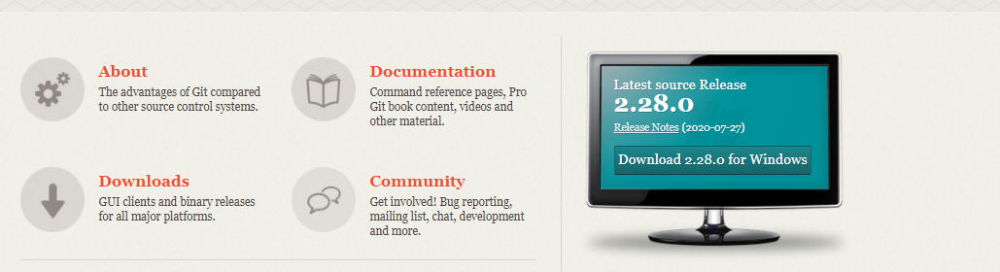
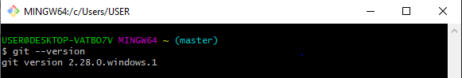
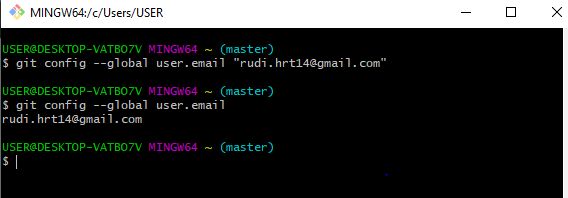
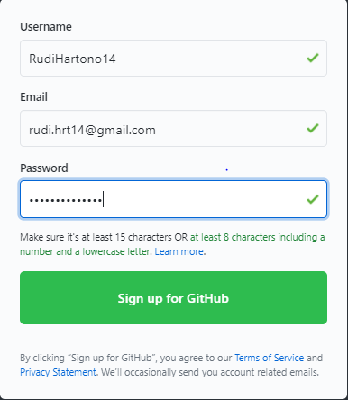
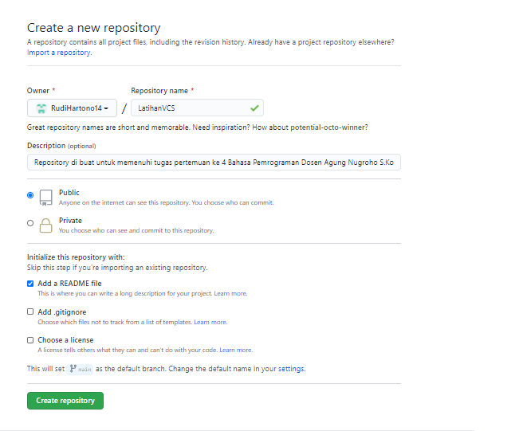
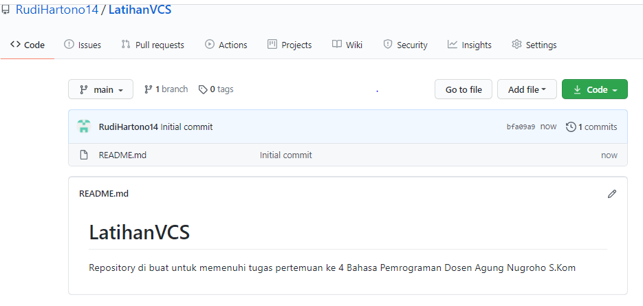
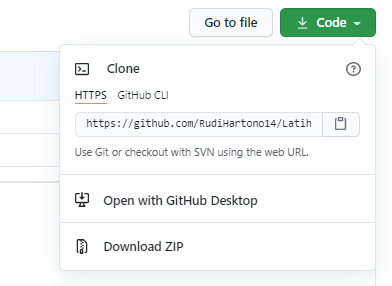
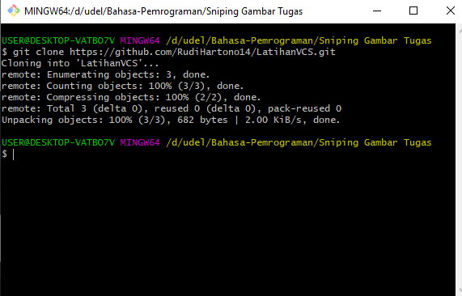

# LatihanVCS
Repository di buat untuk memenuhi tugas pertemuan ke 4 Bahasa Pemrograman Dosen Agung Nugroho S.Kom

Nama  : Rudi Hartono

Nim   : 312010027

Kelas : TI.20.B.1

## Cara penggunaan Git

* Langkah Pertama Silahkan Download Git Di https://git-scm.com

 

* setelah melalukan Proses Download di Link tersebut silahkan lakukan instalasi 

* setelah melakukan proses instalasi selesai pastikan Git sudah benar-benar terinstal dengan cara search CMD lalu tulis "git" untuk memanggil git

* setelah itu cek lah versi berapa Git yang kita gunakan dengan Cara "git Version"

* jika muncul tampilan Git version itu artinya git sudah terinstal dengan baik, langkah selanjut nya adalah melalukan konfigurasi user name dan email di git dengan mengetikan texs berikut

* git config --global user.name "Masukkan Nama Anda disini" git config --global user.email "Masukkan Email Anda disini"

* Buat akun di GitHub , seperti contoh dibawah ini. Dan lakukan verifikasi akun melalui email yang sudah terdaftar.

* Jika akun GitHub sudah selesai dibuat dan diverifikasi, Proses selanjutnya silahkan buat Repository seperti gamabr dibawah ini. Penjelasan :

- Repository Name : (Silahkan isi nama repository yang diinginkan, seperti contoh saya ingin membuat repository LatihanVCS)

- Description : (Isi dengan deskripsi atau penjelasan tentang repository Anda)

- Public / Private : (PIlih salah satu jenis repository akan bisa dilihan sama semua orang atau tidak)

- Add a README.md file : Centang pada bagian ini jika Anda menginginkan file README.md ada di repository Anda

- Add .gitignore : Merupakan sebuah file yang berisi daftar nama-nama file dan direktori yang akan diabaikan oleh Git.

- Choose a license : Silahkan centang jika Anda memiliki lisensi pada repository yang akan dibuat Kemudian tekan tombol Create Repository untuk menyimpan

* Jika repository sudah dibuat maka akan muncul tampilan seperti dibawah ini :

* Pembuatan akun dan repository pada Github telah selesai, saat ini akan kita lakukan untuk me-remote repository Github pada GitBash Lokal. Bagaimana caranya? Langkah pertama kita harus menyalin link URL git kita di Github, dengan cara tekan tombol Code lalu klik Copy.

* Setelah Link URL git kita tercopy, Silahkan buka File Explorer pada Windows, kemudian pilih folder dimana kita akan mendownload Repository dari Github ke lokal. Kemudian Klik Kanan, Pilih Git Bash Here.

* op Up Command Prompt (CMD) akan terbuka. Pada proses ini kita akan melakukan download file repository yang tadi dibuat, dengan mengetikkan Texs berikut :

- git clone

